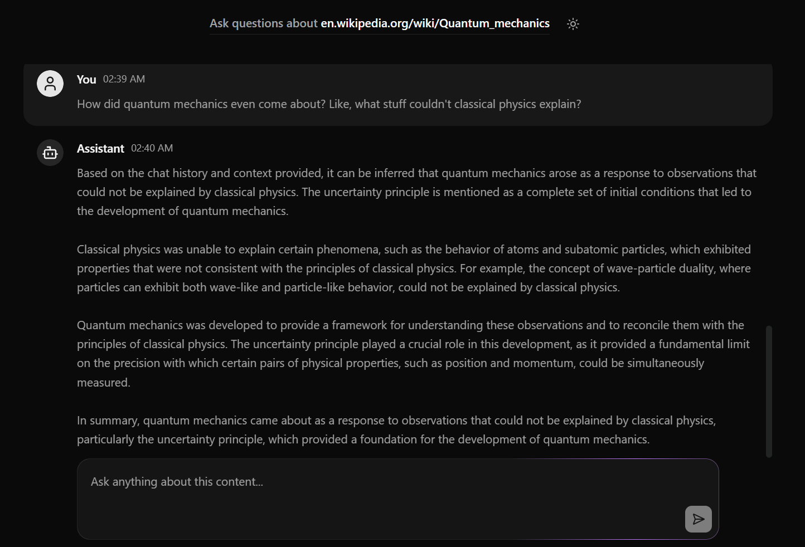

# AI Website Assistant

Hey there! This is an intelligent web application that transforms any website into an interactive knowledge base. Give it a URL, and you can immediately start conversing with the site's content, powered by Ollama and RAG technology. It uses Upstash Redis for caching and session management, along with Upstash Vector Store for data storage.



## Setup Instructions

Create a `.env.local` file in the root directory of your project and add the following environment variables:

```bash
UPSTASH_VECTOR_REST_URL=your_upstash_vector_rest_url
UPSTASH_VECTOR_REST_TOKEN=your_upstash_vector_rest_token

UPSTASH_REDIS_REST_URL=your_upstash_redis_rest_url
UPSTASH_REDIS_REST_TOKEN=your_upstash_redis_rest_token
```

Note that this application uses the Ollama Llama2 model by default, so ensure you have Ollama installed locally on your machine. You can also use any model compatible with OpenAI—just configure it in the `lib/rag-chat.ts` file.

## Credits

This project was inspired by and built following the tutorial by **Josh tried upstash**.

[Watch the full tutorial here](https://www.youtube.com/watch?v=Ka8GoIUhM3g&t=4045s)

Special thanks to Josh for the excellent walkthrough on building RAG applications with Upstash!
